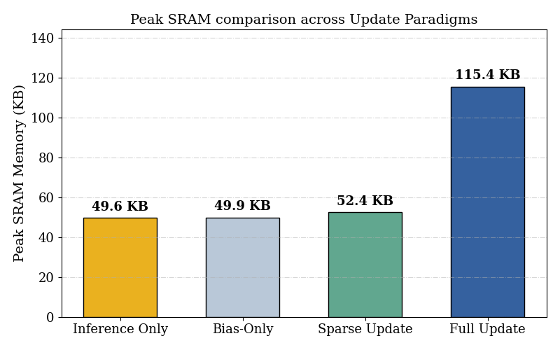
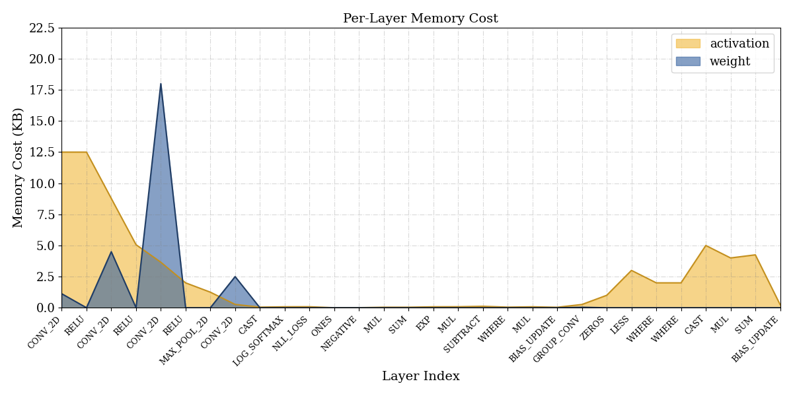
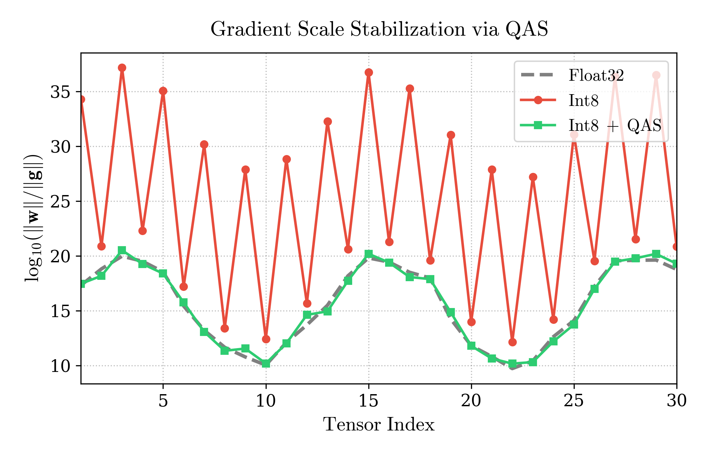

# TinyRadar-OL: Ultra-Low Memory Continual Learning for Personalized FMCW Radar Gesture Recognition at the IoT Edge

[](LICENSE)

Welcome to the official repository for **"TinyRadar-OL: Ultra-Low Memory Continual Learning for Personalized FMCW Radar Gesture Recognition at the IoT Edge"**. This repository provides the complete framework and source code to replicate the Tiny Training Engine (TTE) pipeline, designed for continuous learning and adaptation directly on microcontrollers (MCUs) at the edge.

## 🌟 Overview

TinyRadar-OL introduces a breakthrough in running **on-device training** for Hand Gesture Recognition (HGR) using FMCW radar. By leveraging our custom **Tiny Training Engine (TTE)**, the framework performs full int8-quantized forward passes and customized backward passes. This allows edge devices to personalize gesture recognition models on the fly while operating under strict ultra-low memory constraints, eliminating the need to transmit sensitive sensor data to the cloud.

### Key Highlights
- **Ultra-Low Memory Footprint**: Drastically optimized SRAM usage during both inference and backward propagation (training).
- **On-Device Continual Learning**: Adapts dynamically to user-specific gestures locally.
- **End-to-End TTE Pipeline**: Provides a workflow from a PyTorch model down to C code optimized for ARM Cortex-M MCUs and PC simulation.

---

## 📊 Performance & Results

Our methodology achieves significant reductions in memory overhead compared to traditional edge training systems, while maintaining robust model accuracy and training stabilization.

### Peak SRAM Memory Comparison
TinyRadar-OL dramatically lowers peak memory requirements compared to conventional methods.
<p align="center">
  
</p>

### Per-Layer Memory Breakdown
Detailed profiling of memory consumption across different neural network layers during training.
<p align="center">
  
</p>

### Training Stabilization (QAS)
Our Quantization-Aware Scaling (QAS) technique ensures stable on-device learning without diverging.
<p align="center">
  
</p>

---

## 🚀 Pipeline Instructions

This repository encapsulates the end-to-end pipeline. It contains the pre-compiled C outputs in `scripts/codegen/` and the runtime Code Composer Studio (CCS) project in `TTE-HGR`.

### Prerequisites
- Code Composer Studio (CCS) / TI ARM Clang Compiler (for MCU deployment)
- GCC Compiler (for PC simulation)

### 1. Model Conversion & Quantization (Offline)
The offline phase involves tracing the PyTorch model (`assets/model.pt`), performing int8 quantization, generating the backward graph, and serializing it into an IR JSON format. 
*Outputs provided in this repo:* `assets/int8-graph.json`, `assets/int8-params.pkl`, `assets/scale.json`.

### 2. Code Generation (Codegen)
The intermediate JSON representation is parsed and transformed into optimized C code using the Tiny Training Engine compiler.
*Outputs provided in this repo:* The generated C code and network headers are located under `scripts/codegen/`.

### 3. PC Simulation
If you wish to test the model and training loop on a PC emulator before flashing to an MCU, you can compile the project using standard GCC. This uses the `arm_intrinsics_mock.h` header to simulate ARM CMSIS-NN math functions on x86:

```bash
gcc -O3 -o tte_main \
  -include TTE-HGR/TinyEngine/include/arm_intrinsics_mock.h \
  TTE-HGR/main.c \
  scripts/codegen/Source/genModel.c \
  TTE-HGR/TinyEngine/src/kernels/int_forward_op/arm_convolve_s8_4col.c \
  TTE-HGR/TinyEngine/src/kernels/int_forward_op/maxpooling.c \
  TTE-HGR/TinyEngine/src/kernels/fp_requantize_op/convolve_1x1_s8_fpreq_mask.c \
  TTE-HGR/TinyEngine/src/kernels/fp_requantize_op/mat_mul_kernels_fpreq.c \
  TTE-HGR/TinyEngine/src/kernels/fp_backward_op/log_softmax_fp.c \
  TTE-HGR/TinyEngine/src/kernels/fp_backward_op/nll_loss_fp.c \
  TTE-HGR/TinyEngine/src/kernels/fp_backward_op/tte_exp_fp.c \
  TTE-HGR/TinyEngine/src/kernels/fp_backward_op/sum_3D_fp.c \
  TTE-HGR/TinyEngine/src/kernels/fp_backward_op/sum_4D_exclude_fp.c \
  TTE-HGR/TinyEngine/src/kernels/fp_backward_op/group_pointwise_conv_fp.c \
  TTE-HGR/TinyEngine/src/kernels/fp_backward_op/sub_fp.c \
  TTE-HGR/TinyEngine/src/kernels/fp_backward_op/mul_fp.c \
  TTE-HGR/TinyEngine/src/kernels/fp_backward_op/where_fp.c \
  -ITTE-HGR/TinyEngine/include \
  -ITTE-HGR/TinyEngine/third_party/CMSIS \
  -Iscripts/codegen/Include \
  -lm

# Run the compiled binary
./tte_main
```
*The console will output the simulation results, training loss, inference latency, and energy comparisons.*

### 4. MCU Compilation & Deployment
The actual on-device runtime is built using the Code Composer Studio project.
1. Open **Code Composer Studio**.
2. Import the `TTE-HGR` directory as a CCS Project.
3. The project is pre-configured to link the generated model (`genModel.c`), the Tiny Training Engine backend kernels (`TinyEngine/src`), and the main driver (`main.c`).
4. Build the project using the **Release** or **Debug** configuration.
5. Flash the generated binary onto the target MCU for on-device inference and continual learning.

---

## 📜 Citation
If you find this code or our methodology useful for your research, please consider citing our manuscript:

```bibtex
@article{tinyradar_ol_2026,
  title={TinyRadar-OL: Ultra-Low Memory Continual Learning for Personalized FMCW Radar Gesture Recognition at the IoT Edge},
  author={Trinh, Tuan and others},
  journal={TBD},
  year={2026}
}
```

## ⚖️ License
This project is licensed under the MIT License - see the [LICENSE](LICENSE) file for details.
